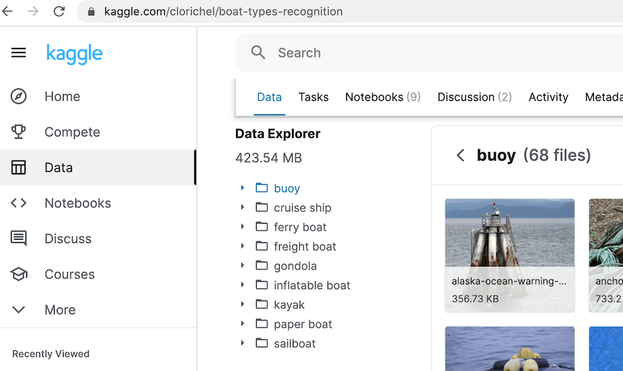

# Getting Started

```{.python .input  n=1}
#@hide
%load_ext autoreload
%autoreload 2
%matplotlib inline

from IPython import display
import pandas as pd

display.set_matplotlib_formats('svg')
pd.set_option('precision', 2)
```

This tutorial explains how to get a built-in image classification datasets and how to construct a customized one. 

## Getting a Built-in Dataset

Let's first import the `Dataset` class from the `image_classification`. Calling its class method `list` will return the list of build-in dataset names.

```{.python .input  n=2}
from autodatasets.image_classification import Dataset

names = Dataset.list()
len(names), names[:5]
```

Next we can use the class method `get` to retrieve a dataset by its name. For the first time to get this dataset, `autodatasets` will download its data to the `.autodatasets/name` folder on the home directory, here `name` is the dataset name. Then we call the `summary` method to give the basic information about the downloaded dataset.

```{.python .input  n=3}
ds = Dataset.get('boat')
ds.summary()
```

We can also print several examples with its labels.

```{.python .input  n=4}
ds.show()
```

Each example is presented as a pair of Numpy ndarray and string. The former contains the image pixels in the format of (height, width, channels) and the latter is the class name.

```{.python .input}
x, y = ds[10]
type(x), x.shape, y
```

Note that even if the original dataset has a split between training and validation, `autodatasets` merges all examples together. We can use the `split` method to construct that split manually. The following code randomly picks 80% examples as the training set, and the rest as the validation set.

```{.python .input}
train, valid = ds.split(0.8)
len(train), len(valid)
```

We can also export a dataset into the format needed by other libraries. For example, we can export it to a MXNet dataset (you need to have MXNet installed).

```{.python .input}
mx_ds = train.to_mxnet()
type(mx_ds).mro()[1]
```

You can find more examples for how to train models by using these datasets in :ref:`image_classification_use_cases`. 

Lastly, we summary all built-in datasets.

```{.python .input}
Dataset.summary_all(quick=True)
```

More details about each dataset are available in :ref:`image_classification_built_in`. 

## Constructing Your Own Datasets

Let's start with a common case that all images belong a class are stored in a folder named by that class. For example, if there are two classes named `cat` and `dog`, and data are stored in the `root` folder. Then a typical structure looks like

```bash
root/cat/1.jpg
root/cat/1122.jpg
...
root/dog/a.jpg
root/dog/123.png
...
```


Using the [Kaggle  boat dataset](https://www.kaggle.com/clorichel/boat-types-recognition) as an example. If you check the `Data Explorer` panel in the page, you will find there are 9 folders, such as `buoy` and 
`cruise ship`, in the top directory. 


:width:`600px`


Now we can construct the dataset through the class method `from_folders` by passing the dataset URL `'kaggle:clorichel/boat-types-recognition'` and root directory `'.'`  as arguments. Here the URL format is a `kaggle:` prefix followed by the user name and dataset name. Its data will be automatically downloaded. You can specify a normal URL such as `http://example.com/data.zip` or a local file/folder. 

The following code register the dataset with the name `boat` by given its construction function and arguments. We can obtain it by `Dataset.get('boat')` as demonstrated before.

```{.python .input}
Dataset.add('boat', Dataset.from_folders, 
            ['kaggle:clorichel/boat-types-recognition', '.'])
```

Besides `from_folders`, there are other convenient methods to construct datasets. You can check how we constructed all the built-in datasets in :ref:`image_classification_constructing`.
